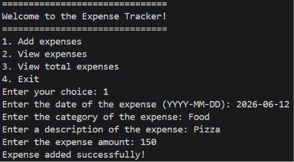
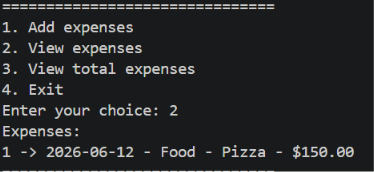
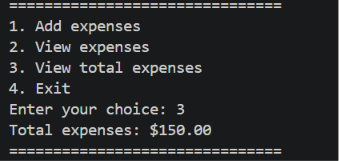

# Expense Tracker

A Python-based Expense Tracker developed as part of the DecodeLabs Python Industrial Training Kit.

## Features
- Add expenses
- View all expenses
- Calculate total expenses
- Input validation
- Prevent negative values

## Technologies Used
- Python
- Lists
- Dictionaries
- Loops
- Exception Handling
## Screenshots

### Adding Expense

### Viewing Expenses

### Viewing Total Expenses

## Author
Yashashwin